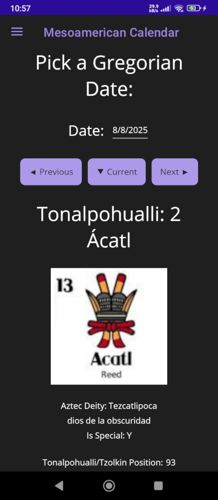

# Date Translator for Aztec calendar

Finds the Tonalpohualli day (moon based) and the Xiuhpōhualli (sun based) dates of the Aztec calendar using a Gregorian date.

# Screenshots

## Android

## Windows

